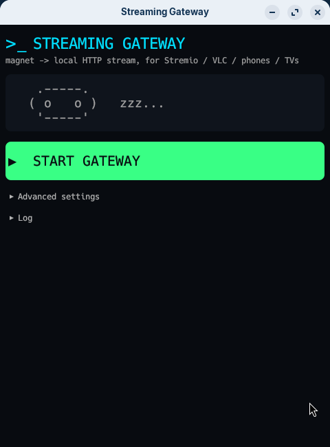
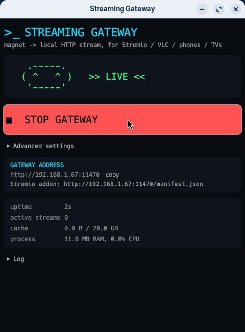

<div align="center">

# 🎬 Streaming Gateway

### Watch any movie on your phone, streamed from your own PC.

<p>


</p>

</div>

---

## What is this?

You search for a movie in **Stremio** on your phone. It starts playing in a few
seconds. There is no subscription, no cloud service, and nothing is stored on
your phone — your own PC finds the movie, downloads only the part you are
currently watching, and streams it over your WiFi.

Think of it as a **personal Real-Debrid that runs on your own computer**.

**How it works, in one line:** your PC runs a small server → it searches for
torrents → it downloads only the piece you are watching → it serves that to
your phone as a normal video stream you can pause and seek.

### What you get

| | |
|---|---|
| 🔎 **Search built in** | Type a movie name in Stremio, get results. No magnet links to copy. |
| ⚡ **Starts in seconds** | Downloads the beginning first, not the whole file. |
| ⏩ **Seek anywhere** | Jump to any point; it fetches just that part. |
| 📱 **Any device** | Stremio, VLC, browsers, smart TVs — anything that plays a URL. |
| 🖥️ **One-click app** | Desktop app with a big Start button. No terminal needed. |
| 🔒 **Stays on your network** | Video never leaves your WiFi. |

---

# Setup guide

Follow these in order. Total time: about 5 minutes.

## Step 1 — Install on your PC

Open a terminal in this folder and run:

```bash
./setup.sh --gui
```

That one command does everything: installs what's missing, builds the app,
creates the installer package, installs it, and puts a **NovaStream** icon on
your desktop and in your applications menu.

> [!NOTE]
> It asks for your password once (to install the package). It never touches
> Node, Python, or OpenSSL — none are needed.

**Server only, no desktop app?** Use `./setup.sh` instead. Good for a headless
home server or NAS.

## Step 2 — Start the server

Click the **NovaStream** icon on your desktop, then click the big green
**START GATEWAY** button.

<table>
<tr>
<td></td>
<td></td>
</tr>
<tr>
<td align="center"><sub>Click to start</sub></td>
<td align="center"><sub>Running — shows your address</sub></td>
</tr>
</table>

The app prints **two** addresses. The `https://…local-ip.sh:8443` one is what
Stremio needs (step 3); the plain `http://192.168.1.67:8080` one is for VLC,
browsers and TVs.

Prefer a terminal? `./target/release/streaming-gateway` does the same thing.

## Step 3 — Add it to Stremio on your phone

**There is no tunnel step. There used to be. It's gone.**

When the gateway starts it prints an `https://` address of its own, like:

```
PASTE THIS INTO STREMIO (Addons -> search bar):
https://192-168-1-67.local-ip.sh:8443/manifest.json
```

That address points **straight at your PC over your WiFi** — nothing is
relayed through anyone else's server. Then:

1. Install **Stremio** from the Play Store and sign in
2. Make sure your phone is on the **same WiFi** as your PC
3. Open **Addons** (the puzzle-piece icon at the bottom)
4. Tap the search bar at the top
5. Paste the exact address the app printed, ending in `/manifest.json`
6. Tap **Install**

You should now see **Local Streaming Gateway** in your installed addons.

<details>
<summary><b>Why the odd-looking address, and is it safe?</b></summary>

Stremio's Android app refuses to load an addon over plain `http://`, and no
certificate authority will ever issue a certificate for `192.168.1.67` —
private addresses have been banned from public certificates since 2015.

The way around both is a hostname. `192-168-1-67.local-ip.sh` is a public DNS
name that resolves right back to `192.168.1.67`, and
[local-ip.sh](https://local-ip.sh) publishes a genuine Let's Encrypt
certificate for `*.local-ip.sh`. Your PC serves that certificate, so your phone
sees a real, trusted `https://` site — while every byte stays on your WiFi.
Only the DNS lookup touches the internet.

**The honest caveat:** that certificate's private key is published too, so
anyone can download it. This gives you encryption but *not* proof of identity —
someone already on your WiFi could impersonate the address. It is strictly
better than the plain `http` it replaces, and fine for streaming films at home,
but it is not a secret-keeping channel.

Want real security? Point a domain you own at `192.168.1.67`, get a
certificate for it via a DNS-01 challenge (works fine for a private address —
the authority checks a DNS record, it never connects to your machine), and
start the gateway with `--tls-cert-file` and `--tls-key-file`. A free
[deSEC](https://desec.io) `dedyn.io` subdomain is enough; no purchase needed.

</details>

## Step 4 — Watch something

1. Search for a movie in Stremio
2. Open it and look at the stream list
3. Pick an entry marked **⚡ Direct** (not 🌍 Away — see below)
4. Press play, then **wait about 10 seconds** for the first start

<div align="center">

### 🎉 That's it. You're watching.

</div>

---

## Picking a good stream

Each result shows two numbers that decide whether it plays smoothly:

```
⚡ Direct 1080p
Movie.2026.1080p.WEB-DL.x265
👤 1463   💾 1.56 GB
   ▲         ▲
   │         └── file size — smaller starts faster
   └── seeders — more is better, this matters most
```

**Rules of thumb:**

- **Pick high 👤 seeders.** This is the single best predictor of smooth playback.
- **Prefer smaller files.** A 1.5 GB x265 release needs far less speed than a
  5 GB one and starts much sooner.
- **Avoid 4K / 2160p** unless your internet is fast. A 23 GB 4K movie needs
  roughly 3.6 MB/s sustained — more than most home connections deliver.

**Not sure if your connection can handle it?** Divide the file size (GB) by the
movie length (hours). Under 2 GB/hour is comfortable on most connections.

---

## Watching from a different WiFi

Genuinely away from home — mobile data, a friend's WiFi, a hotel — is the one
case the local address cannot cover, because `192.168.1.67` means nothing
outside your house. For that you still need a tunnel (ngrok, Cloudflare Tunnel)
pointed at port 8080, and you add *its* https address to Stremio instead.

When you reach the addon that way, every movie grows a second entry marked
**🌍 Away** that plays through the tunnel.

**Only use 🌍 Away when you are actually away.** Both entries play the identical
file, but 🌍 Away sends every byte out to a relay on the internet and back —
measured at roughly **2 MB/s**, against local-disk speed for ⚡ Direct. On your
home WiFi it is strictly the worse choice, and picking it there looks exactly
like the gateway being slow: playback limps and every seek has to refill the
player's buffer through the relay.

On your own WiFi the 🌍 Away entry does not appear at all — the gateway
recognises its own `local-ip.sh` address as a local one and does not offer a
slow route to a device that already has a fast one.

---

## Watching on VLC, a browser, or a TV

You don't need Stremio. Any player that opens a URL works:

```
http://192.168.1.67:8080/play?magnet=<your-magnet-link>
```

- **VLC (phone):** ☰ menu → Stream → paste the URL
- **VLC (desktop):** Media → Open Network Stream → paste
- **Browser:** just open the URL
- **Smart TV:** any "play from URL" app, e.g. VLC for Android TV

---

## Settings

Everything has a sensible default. Change these only if you need to:

| Setting | Default | What it does |
|---|---|---|
| `GATEWAY_PORT` | `8080` | Port to listen on |
| `HTTPS_PORT` | `8443` | Port for the https address you paste into Stremio |
| `DISABLE_HTTPS` | `false` | Turn off https (you would then need a tunnel again) |
| `TLS_CERT_FILE` | — | Use your own certificate instead of the published one |
| `MAX_CACHE_SIZE_GB` | `20` | Disk limit before old movies are deleted |
| `IDLE_PAUSE_SECS` | `300` | Pause a movie you stopped watching, to free bandwidth |
| `PREBUFFER_BYTES` | `4 MB` | Data to gather before playback starts |
| `STALL_TIMEOUT_SECS` | `20` | If playback gets no data for this long, quietly reconnect |
| `CLIENT_TIMEOUT_SECS` | `900` | Hang up on a player that stopped responding, freeing its movie |
| `MAX_PEERS_PER_TORRENT` | `60` | Peers per movie. Higher is not faster on a home connection |
| `MAX_DOWNLOAD_MB_S` | `0` (off) | Cap download speed. See "Playback keeps buffering" |
| `MAX_UPLOAD_MB_S` | `0` (off) | Cap upload/seeding speed |
| `INDEXER_URL` | Torrentio | Where movies are searched for |
| `DISABLE_INDEXER` | `false` | Turn off search entirely |
| `LOG_LEVEL` | `info` | Set to `debug` for troubleshooting |

Set them like this:

```bash
MAX_CACHE_SIZE_GB=100 ./target/release/streaming-gateway
```

> [!TIP]
> If you watch 4K, raise `MAX_CACHE_SIZE_GB` to at least **100**. A single 4K
> movie can be 23 GB — larger than the default cache limit, which would make it
> delete itself while you watch.

---

## Troubleshooting

<details>
<summary><b>Stremio won't install the addon / it just spins forever</b></summary>

First check you pasted the `https://…local-ip.sh:8443/manifest.json` address and
not the plain `http://192.168.…` one. Stremio's Android app silently rewrites
`http://` to `https://` before it even connects, so an http address can only
ever fail — and it fails as an endless spinner with no error.

If the https address also spins, your **router may be blocking it**. That
address is a public name that points to a private one, and some routers discard
those answers ("DNS rebinding protection"). To check, on your phone go to
**Settings → Network & internet → Private DNS → Private DNS provider hostname**
and enter `dns.google`. If the addon installs now, that was it. Either leave
that setting on, or add `local-ip.sh` to your router's DNS-rebind exception list
(FRITZ!Box: *Home Network → Network → Network Settings → DNS Rebind Protection*;
OpenWrt: *Network → DNS → Filter → Domain whitelist*).
</details>

<details>
<summary><b>The addon installed, but no "Local Gateway" streams appear</b></summary>

Stremio caches the old addon. **Uninstall** it in the Addons list, then install
it again. Also check the addon's description says *"Streams movies and series…"*
— if it says *"Not a search/indexer"*, that's a stale cached copy.
</details>

<details>
<summary><b>It says "Switching to VLC/Exo" and never plays</b></summary>

Almost always means you pressed play too early. The torrent needs ~10 seconds to
find peers. Go back, wait, and press play again.

If it still fails, the release probably has too few seeders — pick one with a
higher 👤 number.
</details>

<details>
<summary><b>Playback keeps buffering</b></summary>

Check the file size against your connection. A 5 GB movie needs about 0.8 MB/s
sustained; a 23 GB 4K one needs 3.6 MB/s. **Pick a smaller release** — this
fixes it far more often than anything else.

Check what's using bandwidth:
```bash
curl -s http://localhost:8080/health | python3 -m json.tool
```

**If the PC is on WiFi rather than a cable, that is the next thing to look at**,
and it is usually the real answer when the numbers above look fine. Two
different flows share the one radio: the movie coming *in* from peers, and the
same movie going back *out* to your phone. They are not additive on a wired
machine — on WiFi they compete for the same airtime, and the radio can only do
one at a time. The gateway also downloads well ahead of what you are watching
(that is what makes seeking quick), so it can easily be pulling 3–4 MB/s to
feed a stream that only needs 1.5 MB/s, and the surplus is spent on exactly the
airtime the phone is waiting for.

Check which band you're on:
```bash
iwconfig 2>/dev/null | grep -i frequency
```

`2.4 GHz` is the crowded one — shared with your neighbours, Bluetooth and
microwaves — and it rarely sustains what the nominal link rate suggests.
**Moving the PC to 5 GHz, or plugging in an ethernet cable, does more than any
setting here.** Failing that, stop the gateway racing ahead:

```bash
MAX_DOWNLOAD_MB_S=3 MAX_UPLOAD_MB_S=1 ./target/release/streaming-gateway
```

Set the download cap a little above the movie's real bitrate (size in GB
divided by length in hours). It makes the download slower and the picture
steadier.
</details>

<details>
<summary><b>Downloads keep disappearing</b></summary>

Your cache limit is too small, so it deletes movies to stay under it. Raise it:
```bash
MAX_CACHE_SIZE_GB=100 ./target/release/streaming-gateway
```
</details>

<details>
<summary><b>Seeking takes a long time</b></summary>

Jumping to a part that hasn't downloaded yet means fetching it first — usually a
few seconds. Torrents transfer in chunks of 4–16 MB, so even one second of video
requires a whole chunk. Seeking backwards into what you've already watched is
instant.
</details>

<details>
<summary><b>My phone can't reach the PC at all</b></summary>

If you're on a WiFi extender or guest network, see
[Watching from a different WiFi](#watching-from-a-different-wifi) — you'll need
a tunnel and the **🌍 Away** stream entry it unlocks.
</details>

---

## Is this legal?

This tool is a **BitTorrent client with a video player attached**. It does not
host, index, or provide any content — exactly like qBittorrent or Transmission.

**You are responsible for what you download.** Downloading copyrighted material
without permission is illegal in most countries. Use it for public-domain films,
Creative Commons media, Linux ISOs, or content you own.

---

<details>
<summary><h2 style="display:inline">For developers</h2></summary>

### Why Rust

Streaming is a latency problem, not a throughput one: a seek must translate into
"fetch this piece now" with no GC pause. Rust gives predictable latency, real
parallelism, and a single static binary with no runtime.

The torrent engine is [`librqbit`](https://github.com/ikatson/rqbit) — already
correct on the hard parts (streaming-aware piece selection, a reader that blocks
on a missing piece and wakes when it arrives). Reimplementing that would only
produce a worse copy. This project adds what it deliberately doesn't: a
Stremio-shaped API, LAN discovery, a size-capped cache, and monitoring.

### Layout

```
crates/
  gateway/              the server
    src/
      lib.rs              router, startup, shared state
      torrent/            librqbit wrapper, file selection, idle pausing
      streaming/          HTTP Range serving + pre-buffering
      stremio/            /manifest.json + /stream/{type}/{id}.json
      indexer/            torrent discovery by IMDB id
      cache/              size-capped eviction
      network/  config/  monitoring/  error.rs
    tests/http_api.rs     integration tests against the real router
  gateway-gui/          desktop launcher (eframe/egui)
setup.sh   Dockerfile
```

### Design notes

- **https is served directly from the LAN, no tunnel.** Stremio's Android addon
  fetcher hard-refuses plain http and trusts only a public CA chain (it bundles
  its own root store — installing a CA on the phone does nothing). No authority
  will certify a private IP, so the gateway serves a published Let's Encrypt
  wildcard for a hostname (`local-ip.sh`) that resolves back to the LAN address.
  http keeps running unchanged on its own port for everything else. See the
  `tls` module header for the full reasoning and its honest limits.
- **The gateway recognises its own https hostname as local.** Otherwise a
  request arriving on a public-looking name would look like a remote client and
  get offered a needless, slower fallback route.
- **Stream URLs carry no query string.** Stremio hands URLs to external players
  via Android intents, where a long percent-encoded magnet is easy to mangle.
  `/videos/<hash>/<idx>` survives that.
- **`/videos` only starts hashes the gateway advertised.** Otherwise anyone who
  could reach the port could make it join arbitrary swarms.
- **A live reader always blocks the idle reaper, not just request recency.**
  Players buffer minutes ahead and go quiet, so recency alone reads an actively
  watched movie as idle — and librqbit's reader has no timeout of its own, so
  pausing under it freezes playback permanently rather than just slowing it.
- **Which makes a departed viewer dangerous, so the sockets time out.** A
  player that stops reading without closing — backgrounded, force-quit, off the
  wifi — leaves TCP zero-window probing, which by default continues forever.
  The response body stays parked, its `StreamGuard` stays held, and that guard
  is what exempts the torrent from the reaper, the janitor *and* the
  switched-title cleanup. Every abandoned stream would otherwise pin one
  torrent downloading for nobody, for the life of the process.
  `TCP_USER_TIMEOUT` on the listening socket (inherited by every accepted one)
  is what ends them; keepalive alone cannot, as it is suppressed while probes
  are outstanding.
- **The cache is measured in allocated blocks, not file length.** librqbit
  creates each file at its full final size before downloading any of it, so
  `len()` reports a 5 GB movie as 5 GB of cache the moment playback starts —
  which both looked absurd and made the janitor evict torrents to get under a
  cap it was nowhere near.
- **Responses are withheld until data exists.** Players treat "headers, then a
  stalled body" as a broken stream, but wait patiently on a slow request.

### Build & test

```bash
cargo build --release              # both crates
cargo test --release               # 67 tests
cargo clippy --release --all-targets -- -D warnings
cargo deb -p streaming-gateway-gui # .deb package
```

Docker (server only):
```bash
docker build -t streaming-gateway .
docker run -d --network host -v gw-data:/data streaming-gateway
```
Use `--network host`, or the startup banner prints the container's internal IP
instead of your LAN address.

### API

| Endpoint | Purpose |
|---|---|
| `GET /manifest.json` | Stremio addon manifest |
| `GET /stream/{type}/{id}.json` | Stream list for a title |
| `GET /videos/{hash}/{idx}` | The video itself (Range supported) |
| `GET /play?magnet=…` | Resolve a magnet and redirect to the video |
| `GET /health` | Status, active torrents, cache usage |

</details>

---

<div align="center">
<sub>MIT licensed · Built with Rust, axum, and librqbit</sub>
</div>
